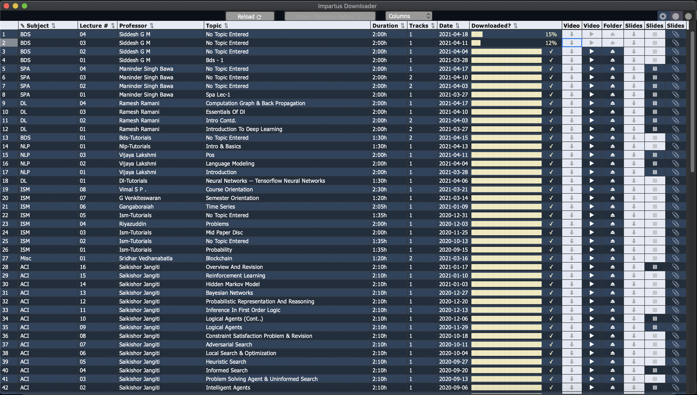

Impartus Downloader
===

Downloader for impartus streaming videos.

- Convert impartus lectures to mkv files.
- Supports downloading regular and flipped lecture.
- Tested on Mac, Linux (ubuntu) and Windows 10.
- Multi view/track files supported. Tested with files up to 4 tracks.
- Parallel downloads supported. 
- Pause / Resume individual downloads.
- Editable subject field to use shorter subject names and better organize the folders.
- Auto Organize lecture videos by moving / renaming to match the lecture topic, subject (nick)name or the path structure.
due to change in topic on server, new short-subject name mapping or change in video/slides path.
- Download Lecture slides.
- Attach slides downloaded manually (from other sources) to the lecture folder.
- Sortable content.
- Customizable color schemes, fonts.
- Configurable columns.
- Color scheme change via the UI.

___

### UI

### Demo video

## Installation / Run

Ensure python version is >= 3.6

#### Setup virtualenv (optional)
>	$ virtualenv venv
>
>	$ source venv/bin/activate 

#### Clone repo
>	$ git clone https://github.com/paljsingh/impartus-downloader.git
>
>	$ cd impartus-downloader

#### Install dependencies

- OSX, Linux

>  
>	$ pip3 install -r requirements.txt
>

- Windows

>  
>	$ pip3.exe install -r requirements.txt
>

#### Install ffmpeg

- OSX
>
> $ brew install ffmpeg
> 

- Linux (Ubuntu)
>
> $ sudo apt-get install ffmpeg
> 

- Windows
> Download the win64-gpl zip from the following link, extract and copy ffmpeg.exe to
>  impartus-downloader folder. The ffmpeg.exe statically bundles the dependent libs and
> should be about 90 MB in size.
> 
> [https://github.com/BtbN/FFmpeg-Builds/releases](https://github.com/BtbN/FFmpeg-Builds/releases)
>

#### Run application

- OSX, Linux
>
> $ python3 App.py
>

- Windows
>
> $ python.exe App.py
>

## Configuration

see etc/impartus.conf

## Unit Tests

>
> $ python3 -m pytest -v test
>

## Todo
* Option to download auto-generated slides.
* Add metadata tags to slides to preserve mapping across lecture topic / video rename.
* Improve fuzzy matching of videos to slides by making use of slide name and content.

## Known Issues
* Lecture slides to video mapping may be incorrect. The impartus platform does not offer a strict video to lecture slides mapping, the application uses the upload dates of the two for a fuzzy match.
* Impartus site may start throttling the connections if there are too many parallel downloads. The application uses retry logic with induced delay. However, if the issue persists you may need to restart the app.
* Application crashes on Linux with error 
 X Error of failed request:  BadLength (poly request too large or internal Xlib length error)`

The issue is caused by a bug in libXft and can be resolved by uninstalling fonts-noto-color-emoji
>
> $ sudo apt-get remove fonts-noto-color-emoji
>

Drop a mail to paljsingh@gmail.com for any issues/errors.
